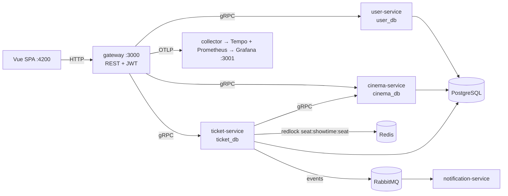

# Ticketing Cinema (CinX)

Microservices cinema ticketing: Vue SPA + REST gateway + NestJS gRPC services, Postgres per service, Redis seat locks, Xendit payments.

## Architecture



**Booking flow:** `POST /bookings/holds` locks seats (5-min redlock, `409` on contention) → `PENDING` booking. `POST /bookings/:id/pay` creates a Xendit invoice → user pays on Xendit page. Xendit webhook (or `POST /bookings/:id/sync-payment` fallback) flips it to `CONFIRMED` + issues `TKT-XXXXXX` tickets. Expired/cancelled holds release locks (`410` if paid late).

Contracts: `docs/openapi.yaml` (REST) · `docs/ERD.md` (DB) · `packages/shared/proto/` (gRPC).

## Tech stack

| Layer | Choice |
|---|---|
| Monorepo | pnpm workspaces + Turborepo, TypeScript |
| Backend | NestJS; gateway REST → gRPC services |
| Data | PostgreSQL 18 (one DB per service, TypeORM) + Redis 8 redlock |
| Payments | Xendit hosted invoice + webhook |
| Events | RabbitMQ fanout → notification-service (Resend email) |
| Frontend | Vue 3 + Vite + Pinia + Naive UI |
| Observability | OpenTelemetry → Tempo + Prometheus → Grafana |

## Quick start

```bash
cp .env.example .env   # set JWT_SECRET + PG_PASSWORD
pnpm install
pnpm infra:up          # postgres, redis, rabbitmq, observability

pnpm --filter @ticketing/user-service seed:admin  # admin@example.com / admin1234
pnpm --filter @ticketing/cinema-service seed

pnpm build && pnpm dev
```

| Surface | URL |
|---|---|
| Web | http://localhost:4200 |
| REST gateway | http://localhost:3000/api/v1 |
| Health | http://localhost:3000/api/v1/health |
| Grafana | http://localhost:3001 |

```bash
pnpm demo    # register → hold → pay → ticket lookup
pnpm health  # gateway health check
```

## Docker (full stack)

```bash
cp .env.example .env
pnpm docker:up     # build + start everything (only web :4200, gateway :3000, grafana :3001 publish ports)
pnpm docker:seed   # admin + cinema catalog
pnpm demo
```

## Xendit payments

Live provider, no mock. Set in `.env`:

```bash
XENDIT_SECRET_KEY=...
XENDIT_WEBHOOK_TOKEN=...
XENDIT_WEBHOOK_URL=https://<public-host>/api/v1/payments/xendit/webhook
```

```bash
pnpm --filter @ticketing/ticket-service xendit:webhook  # register callback URL
```

Local dev needs a public HTTPS tunnel (`cloudflared tunnel --url http://localhost:3000` or `ngrok http 3000`), then set `XENDIT_WEBHOOK_URL` to the tunnel URL and re-register. Without a callback, payments still confirm via `POST /bookings/:id/sync-payment` (server-side status check).

Smoke test: `401` = bad token; `404 Payment not found` = signature OK, pipeline ran (handler is idempotent, retries safe).

## Tests

```bash
pnpm test   # unit, all workspaces (no infra needed)
pnpm lint
pnpm --filter @ticketing/ticket-service test:integration  # needs pnpm infra:up (409/410/TTL cases)
pnpm --filter web e2e:install && pnpm --filter web e2e    # Playwright full-stack E2E
```

## Benchmarks (k6)

Needs k6 + live seeded stack. See `benchmark/README.md`.

```bash
pnpm bench:smoke; pnpm bench:load; pnpm bench:contention
```

## Repo layout

```
apps/gateway/            REST BFF → gRPC
apps/user-service/       users, auth, JWT
apps/cinema-service/     movies, theaters, showtimes, seats
apps/ticket-service/     bookings, redlock, Xendit
apps/notification-service/ RabbitMQ consumer → email
apps/web/                Vue SPA
packages/shared/         DTOs + proto + gRPC stubs
infra/                   local compose + otel/tempo/prometheus/grafana config
docs/                    openapi.yaml + ERD.md
benchmark/               k6 scripts
```

See `PLAN.md` for build history.
