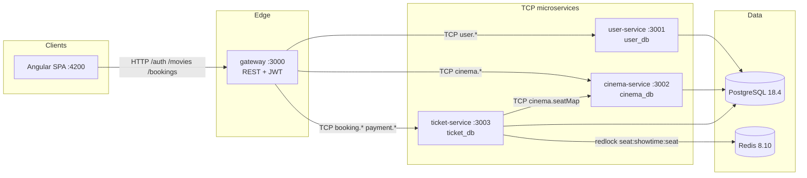

# Ticketing Cinema

Portfolio microservices cinema ticketing system: NestJS services over TCP, a
REST gateway, PostgreSQL (database-per-service), Redis seat locks via redlock,
and an Angular SPA.

## Architecture



**Seat hold flow (ticket-service):**

1. Validate seats with cinema-service (snapshot row/number/category).
2. Acquire a multi-key redlock on `seat:{showtimeId}:{seatId}` (TTL 5 min).
3. Persist `PENDING` booking + seat snapshots + mock payment row.
4. On pay: extend lock → `CONFIRMED` + issue `TKT-XXXXXX` tickets, or fail/cancel.
5. On TTL / cancel / reconcile: release locks; confirm after expiry → **410**.

Contracts: [`docs/openapi.yaml`](docs/openapi.yaml) (REST) · [`docs/ERD.md`](docs/ERD.md) (DB).

## Prerequisites

- Node.js 22+ and [pnpm](https://pnpm.io/) 10 (`corepack enable`)
- Docker + Docker Compose

## Quick start

```bash
# 1. Install + start Postgres + Redis
pnpm install
pnpm infra:up            # postgres:5432, redis:6379

# 2. Seed demo data
pnpm --filter @ticketing/user-service seed:admin
# admin@example.com / admin1234
pnpm --filter @ticketing/cinema-service seed

# 3. Run all apps (gateway + 3 services + web)
pnpm build
pnpm dev
```

| Surface      | URL                                             |
| ------------ | ----------------------------------------------- |
| REST gateway | http://localhost:3000/api/v1                    |
| Health       | http://localhost:3000/api/v1/health             |
| Angular app  | http://localhost:4200 (proxies `/api` to :3000) |

TCP ports: user `3001`, cinema `3002`, ticket `3003`.

## Demo walkthrough

With infra up and apps running (`pnpm dev`):

```bash
pnpm demo               # = ./scripts/demo-walkthrough.sh
```

The script registers (or logs in) a demo user, lists a showtime, holds two seats,
pays with the mock provider, and prints ticket codes. Override `GATEWAY_URL` if
needed.

## Tests

```bash
# Unit tests (all workspaces) — no live infra required
pnpm test

# Lint
pnpm lint

# ticket-service integration (live Postgres + Redis)
pnpm infra:up
pnpm --filter @ticketing/ticket-service test:integration
```

### Frontend E2E (Playwright, full stack)

Boots all 4 services + seeded data + the Angular dev server, then drives a real
browser through the major flows (seat selection → hold, checkout/payment →
tickets, admin CRUD + guard).

```bash
pnpm infra:up                 # Postgres + Redis
pnpm --filter web e2e:install # one-time: download Chromium
pnpm --filter web e2e         # Playwright E2E
```

Specs live in `apps/web/e2e/`; the stack is (re)built and seeded automatically
in `global-setup.ts`.

Integration coverage (`bookings.integration-spec.ts`):

| Case                         | Expectation                                          |
| ---------------------------- | ---------------------------------------------------- |
| Lock contention              | Second hold on same seat → **409**                   |
| TTL expiry                   | Short-TTL redlock auto-releases; re-acquire succeeds |
| Confirm after lock loss      | Deleted Redis key → **410**, booking `EXPIRED`       |
| Confirm when already expired | DB status `EXPIRED` → **410**                        |

## Xendit webhook setup

Xendit confirms bookings asynchronously: after the user pays on the hosted
invoice page, Xendit POSTs an invoice callback to the gateway, which forwards
it (with the `x-callback-token` header) to ticket-service for verification and
booking confirmation. Configure it once per environment:

1. **Set env vars** in `.env` (see `.env.example`):
   - `XENDIT_SECRET_KEY` — secret API key ([Dashboard → Settings → API Keys](https://dashboard.xendit.co/settings/api-keys))
   - `XENDIT_WEBHOOK_TOKEN` — verification token ([Dashboard → Settings → Developers → Webhooks](https://dashboard.xendit.co/settings/developers#webhooks))
   - `XENDIT_WEBHOOK_URL` — public HTTPS URL of the gateway endpoint:
     `https://<your-domain>/api/v1/payments/xendit/webhook`
2. **Register the callback** with Xendit (uses `POST /callback_urls/invoice`):

   ```bash
   pnpm --filter @ticketing/ticket-service xendit:webhook
   ```

   The script registers the URL, verifies Xendit accepted it, and checks that
   `XENDIT_WEBHOOK_TOKEN` matches the token Xendit will send (a mismatch means
   every callback would be rejected with 401).

### Local development (tunneling)

Xendit must be able to reach your gateway over public HTTPS — `localhost`,
`127.0.0.1` and private IPs are unreachable from Xendit's servers, and plain
HTTP is rejected. Two ways to bridge that:

> **No tunnel? No problem.** Without a registered callback, the stack still
> confirms payments end to end: the confirmation page and
> `POST /api/v1/bookings/:id/sync-payment` check the invoice status directly
> with Xendit (server-side, secret-key auth). Use tunnels only when you want
> to exercise the real callback path locally.

#### Quick tunnels (per-session URL, zero setup)

```bash
cloudflared tunnel --url http://localhost:3000
# 🌍 Public access: https://random-words.trycloudflare.com
# — or with ngrok:
ngrok http 3000
# Forwarding: https://xxxx-xx-xx.ngrok-free.app
```

Then point `.env` at it and register (every session — the URL changes on
restart):

```bash
# .env
XENDIT_WEBHOOK_URL=https://random-words.trycloudflare.com/api/v1/payments/xendit/webhook

pnpm --filter @ticketing/ticket-service xendit:webhook
```

- **Pros:** nothing to install beyond the CLI, no account needed (cloudflared
  quick tunnels work without one), instant.
- **Cons:** new URL every restart → re-run the register command each session;
  free-tier URLs are public — rely on the `x-callback-token` for auth (already
  enforced), never on URL secrecy.

#### Stable tunnels (fixed URL, register once)

Worth it if you test callbacks regularly. A named Cloudflare tunnel or an
ngrok domain keeps the same URL across restarts:

```bash
# Cloudflare (needs a domain on Cloudflare + one-time `cloudflared tunnel login`)
cloudflared tunnel create cinx-dev
cloudflared tunnel route dns cinx-dev dev-cinx.example.com
cat > ~/.cloudflared/config.yml <<'EOF'
tunnel: cinx-dev
credentials-file: /home/<you>/.cloudflared/<tunnel-id>.json
ingress:
  - hostname: dev-cinx.example.com
    service: http://localhost:3000
  - service: http_status:404
EOF
cloudflared tunnel run cinx-dev

# ngrok (needs a free account; one reserved static domain on the free tier)
ngrok config add-authtoken <token>
ngrok http --domain=your-reserved.ngrok-free.app 3000
```

With either, set `XENDIT_WEBHOOK_URL` once and the registration sticks until
you change it.

#### Testing the callback end to end

1. Hold seats and pay an invoice on the Xendit test page (test-mode secret key
   → no real money moves).
2. Watch the callback land: gateway logs show
   `POST /api/v1/payments/xendit/webhook` → 200, and ticket-service logs the
   `payment.webhook` span.
3. The booking flips to `CONFIRMED` and ticket codes appear without the SPA
   having to sync.

To debug delivery, Xendit's dashboard (Developers → Webhooks) shows recent
callback attempts and their response codes; `curl`-able replay comes from
Xendit support on request. Local inspection of the raw body:

```bash
# stop the gateway and catch the callback manually:
nc -l 3000
# then trigger a payment and read the raw POST (headers incl. x-callback-token)
```

### Smoke test the endpoint

```bash
curl -i -X POST "https://<your-domain>/api/v1/payments/xendit/webhook" \
  -H "x-callback-token: $XENDIT_WEBHOOK_TOKEN" \
  -H "content-type: application/json" \
  -d '{"id":"inv_smoke","external_id":"cix-none","status":"EXPIRED"}'
```

- `401` — token mismatch (header missing or wrong)
- `404` with `Payment not found` — **success**: signature verified and the
  pipeline ran (Xendit re-sends real callbacks up to 6 times if you don't 2xx,
  and the handler is idempotent, so retries are safe)

## Benchmarks (k6)

[k6](https://k6.io) load tests against the REST gateway. Requires k6 on `PATH`
and a live, seeded stack (`pnpm docker:up && pnpm docker:seed` or `pnpm dev`
with seeded services). See [`benchmark/README.md`](benchmark/README.md).

```bash
pnpm bench:smoke        # 1 VU sanity check
pnpm bench:load         # ramp to N VUs, hold, ramp down (VUS=50 default)
pnpm bench:stress       # aggressive ramp to find the breaking point
pnpm bench:soak         # sustained load for leaks / lock-TTL drift
pnpm bench:contention   # concurrent VUs on one seat -> redlock 409/410
```

Reports built-in HTTP metrics plus per-operation response Trends
(`booking_hold_duration`, `booking_pay_duration`, `seat_map_duration`, …) and
error counters, gated by latency/error-rate thresholds in
`benchmark/options.js`.

## Docker (full stack, network-isolated)

Every deployable has its own `Dockerfile` (`apps/*/Dockerfile`). The root
[`docker-compose.yml`](docker-compose.yml) orchestrates the whole stack with
**network isolation**:

- `public` network — `web` and `gateway`, the **only** services that publish
  host ports (`web :4200`, `gateway :3000`).
- `internal` network (`internal: true`) — gateway, the three TCP microservices,
  Postgres and Redis. No host ports, no outbound access; services reach each
  other and their databases only through internal DNS.

```bash
cp .env.example .env  # set JWT_SECRET + PG_PASSWORD first
pnpm docker:up        # builds all images + starts the stack
pnpm docker:seed      # one-shot demo data (admin + cinema catalog)
pnpm health           # http://localhost:3000/api/v1/health
pnpm demo             # ./scripts/demo-walkthrough.sh
```

| Surface             | URL                                              |
| ------------------- | ------------------------------------------------ |
| Angular app (nginx) | http://localhost:4200 (proxies `/api` → gateway) |
| REST gateway        | http://localhost:3000/api/v1                     |

Images are tagged `ghcr.io/ridwanmuh3/ticketing-cinema/<service>:${IMAGE_TAG:-latest}`.

Other recipes: `pnpm docker:down`, `pnpm docker:logs`, `pnpm docker:images`,
`pnpm docker:config`, `pnpm docker:psql`.

## Observability (OpenTelemetry → Tempo + Prometheus → Grafana)

Every backend service (`gateway`, `user-service`, `cinema-service`,
`ticket-service`, `notification-service`) and the Vue SPA export
**traces + metrics** via OTLP:

```text
Vue SPA --(POST /api/v1/otel)--> gateway --(OTLP/HTTP)--> otel-collector
gateway --(gRPC, traceparent in metadata)--> user/cinema/ticket-service
ticket-service --(OTLP/HTTP)--> otel-collector --+--> Tempo (traces)
                                                 +--> Prometheus :8889 (metrics)
Grafana :3001 reads Tempo + Prometheus (pre-provisioned).
```

One booking flow shares a single trace ID end to end: browser fetch →
gateway (Express) → ticket-service (gRPC) → Postgres/Redis spans, plus
custom spans (`seats.hold`, `payment.charge`, `payment.webhook`,
`booking.confirm`, `notification.send`) and business counters
(`booking_holds_total`, `booking_confirms_total`,
`payment_webhook_received_total`). The RMQ hop links via `traceparent`
stamped into message headers (`injectTraceHeaders` in
`@ticketing/shared`; publishers must call it — see `RmqTraceInterceptor`).

```bash
cp .env.example .env  # then open Grafana at http://localhost:3001
pnpm docker:up        # full stack incl. otel-collector, tempo, prometheus, grafana
pnpm demo             # generate traffic, then Explore → Tempo in Grafana
```

| Surface    | URL                         |
| ---------- | --------------------------- |
| Grafana    | http://localhost:3001       |
| Tempo      | internal only (via Grafana) |
| Prometheus | internal only (via Grafana) |

Knobs (`.env`): `OTEL_TRACES_SAMPLER_ARG` (default `1.0`; lower in
production), `OTEL_METRIC_EXPORT_INTERVAL` (default `60000` ms),
`OTEL_SDK_DISABLED=true` (disable telemetry entirely),
`VITE_OTEL_SAMPLE_RATIO` (default `0.2` — browsers are sampled harder to
bound volume). Privacy: span attributes carry only low-cardinality values
(`showtime.id`, `booking.id`, `user.role`) — never emails, names, or tokens.
With the collector stopped, services keep serving (spans drop after bounded
retries); unit tests always run with the SDK disabled.

## CI/CD

Two GitHub Actions workflows (run them locally with [act](https://github.com/nektos/act)):

- **`.github/workflows/ci.yaml`** — on every PR/push to `main`: pnpm install,
  lint, unit tests, build, format check.
- **`.github/workflows/cd.yaml`** — on push to `main`: builds all five images
  with BuildKit and pushes them to **GitHub Container Registry**
  (`ghcr.io/ridwanmuh3/ticketing-cinema/<service>:{sha,latest}`).

CD is "build-only": it publishes images; deploy manually with
`IMAGE_TAG=<sha> docker compose up -d`. `act` is supported — under `act`
(`ACT=true`) the login/push steps are skipped and images are only loaded into
the local Docker daemon.

```bash
# one-time: install act  (https://github.com/nektos/act)
curl -s https://raw.githubusercontent.com/nektos/act/master/install.sh | sudo bash
pnpm ci:local   # act -W .github/workflows/ci.yaml
pnpm cd:local   # act -W .github/workflows/cd.yaml
```

## Useful commands

```bash
pnpm infra:up / pnpm infra:down / pnpm infra:logs / pnpm health
pnpm infra:psql   # DB=ticket_db pnpm infra:psql
pnpm --filter @ticketing/ticket-service smoke:redis
pnpm --filter @ticketing/ticket-service reconcile
pnpm --filter web build
```

## Repo layout

```
apps/gateway/           REST BFF → TCP
apps/user-service/      users, JWT, roles
apps/cinema-service/    movies, theaters, showtimes, seats
apps/ticket-service/    bookings, redlock, mock payment
apps/web/               Angular standalone SPA
packages/shared/        DTOs + TCP message patterns
packages/eslint-config/ shared ESLint flat config
infra/                  dev docker-compose + init.sql + seed.Dockerfile
docker-compose.yml      full containerized stack (network-isolated)
docs/                   OpenAPI + ERD
scripts/                demo walkthrough
benchmark/              k6 load-test scripts + thresholds
.github/workflows/      CI + CD
```

See [`PLAN.md`](PLAN.md) for build phases and design notes.
